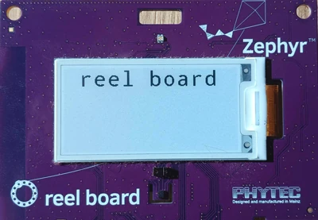

.. _getting_started:

دليل البدء
#####################

اتبع هذا الدليل من أجل:

- إعداد بيئة تطوير Zephyr باستخدام سطر الأوامر على Ubuntu أو macOS أو Windows
  (تجد تعليمات توزيعات Linux الأخرى في :ref:`installation_linux`)
- الحصول على الشيفرة المصدرية
- بناء تطبيق نموذجي ورفعه وتشغيله

.. _host_setup:

اختيار نظام التشغيل وتحديثه
***************************

اختر نظام التشغيل الذي تستخدمه.

.. tabs::

   .. group-tab:: Ubuntu

      يغطي هذا الدليل Ubuntu 24.04 LTS والإصدارات الأحدث. إذا كنت تستخدم
      توزيعة Linux أخرى، فراجع :ref:`installation_linux`.

      .. code-block:: bash

         sudo apt update
         sudo apt upgrade

   .. group-tab:: macOS

      في macOS Mojave أو إصدار أحدث، افتح *System Preferences* >
      *Software Update*. انقر *Update Now* عند الحاجة.

      للإصدارات الأخرى، راجع `موضوع دعم Apple هذا
      <https://support.apple.com/en-us/HT201541>`_.

      .. note::

         لا يدعم Zephyr نظام macOS بمعمارية x86-64.

   .. group-tab:: Windows

      افتح *Start* > *Settings* > *Update & Security* > *Windows Update*.
      انقر *Check for updates* وثبّت التحديثات المتاحة.

.. _install-required-tools:

تثبيت التبعيات
********************

بعد ذلك، ثبّت بعض تبعيات النظام المضيف باستخدام مدير الحزم.

الحد الأدنى الحالي لإصدارات التبعيات الرئيسية:

.. list-table::
   :header-rows: 1

   * - Tool
     - Min. Version

   * - `CMake <https://cmake.org/>`_
     - 3.20.5

   * - `Python <https://www.python.org/>`_
     - 3.12

   * - `Devicetree compiler <https://www.devicetree.org/>`_
     - 1.4.6

.. tabs::

   .. group-tab:: Ubuntu

      .. _install_dependencies_ubuntu:

      #. استخدم ``apt`` لتثبيت التبعيات المطلوبة:

         .. code-block:: bash

            sudo apt install --no-install-recommends git cmake ninja-build gperf \
              ccache dfu-util device-tree-compiler wget python3-dev python3-venv python3-tk \
              xz-utils file make gcc gcc-multilib g++-multilib libsdl2-dev libmagic1

         .. note::

            نظرًا لعدم توفر ``gcc-multilib`` و``g++-multilib`` على أنظمة AArch64
            (ARM64)، قد تحتاج إلى استبعادهما من قائمة الحزم.

      #. تحقق من إصدارات التبعيات الرئيسية المثبتة بإدخال:

         .. code-block:: bash

            cmake --version
            python3 --version
            dtc --version

         قارن الإصدارات بالقيم الواردة في الجدول أعلاه. لمزيد من المعلومات حول
         تحديث التبعيات يدويًا، راجع صفحة :ref:`installation_linux`.

   .. group-tab:: macOS

      .. _install_dependencies_macos:

      #. ثبّت `Homebrew <https://brew.sh/>`_:

         .. code-block:: bash

            /bin/bash -c "$(curl -fsSL https://raw.githubusercontent.com/Homebrew/install/HEAD/install.sh)"

      #. بعد اكتمال تثبيت Homebrew، اتبع التعليمات الظاهرة على الشاشة لإضافة
         مسار التثبيت إلى PATH.

         .. code-block:: bash

            (echo; echo 'eval "$(/opt/homebrew/bin/brew shellenv)"') >> ~/.zprofile
            source ~/.zprofile

      #. استخدم ``brew`` لتثبيت التبعيات المطلوبة:

         .. code-block:: bash

            brew install cmake ninja gperf python3 python-tk ccache qemu dtc libmagic wget openocd

      #. أضف مجلد Python الخاص بـ Homebrew إلى PATH لتتمكن من تشغيل ``python``
         و``pip`` إلى جانب ``python3`` و``pip3``.

           .. code-block:: bash

              (echo; echo 'export PATH="'$(brew --prefix)'/opt/python/libexec/bin:$PATH"') >> ~/.zprofile
              source ~/.zprofile

   .. group-tab:: Windows

      .. note::

         بسبب مشكلات العثور على الملفات التنفيذية، لا يدعم مشروع Zephyr حاليًا
         رفع التطبيقات باستخدام `Windows Subsystem for Linux (WSL)
         <https://msdn.microsoft.com/en-us/commandline/wsl/install_guide>`_
         (WSL).

         لذلك لا نوصي باستخدام WSL عند البدء.

      في إصدارات Windows الحديثة (10 وما بعدها)، نوصي بتثبيت تطبيق Windows
      Terminal من Microsoft Store. وتتوفر التعليمات لموجه أوامر ``cmd.exe`` أو
      PowerShell.

      تعتمد هذه التعليمات على مدير الحزم الرسمي في Windows، وهو `winget`_.
      إذا تعذر استخدامه، فثبّت التبعيات من مواقعها الرسمية وتأكد من إضافة
      أدوات سطر الأوامر إلى متغير البيئة :envvar:`PATH`
      :ref:`environment variable <env_vars>`.

      |p|

      .. _install_dependencies_windows:

      #. يكون winget مثبتًا مسبقًا في إصدارات Windows الحديثة. تحقق من ذلك
         بكتابة ``winget`` في نافذة طرفية. إذا لم يعمل، يمكنك `تثبيت winget`_.

      #. افتح نافذة موجه الأوامر (``cmd.exe``) أو PowerShell. اضغط مفتاح
         Windows، واكتب ``cmd.exe`` أو PowerShell، ثم اختر النتيجة.

      #. استخدم ``winget`` لتثبيت التبعيات المطلوبة:

         .. code-block:: bat

            winget install Kitware.CMake Ninja-build.Ninja oss-winget.gperf Python.Python.3.12 Git.Git oss-winget.dtc wget 7zip.7zip

      #. أغلق نافذة الطرفية.

      .. note::

         قد تحتاج إلى إضافة مجلد تثبيت 7zip إلى ``PATH``.

.. _winget: https://learn.microsoft.com/en-us/windows/package-manager/
.. _install winget: https://aka.ms/getwinget

.. _get_the_code:
.. _clone-zephyr:
.. _install_py_requirements:
.. _gs_python_deps:

الحصول على Zephyr وتثبيت تبعيات Python
******************************************

بعد ذلك، استنسخ Zephyr و:ref:`وحداته <modules>` إلى مساحة عمل جديدة في
:ref:`west <west>`. تستخدم التعليمات التالية الاسم :file:`zephyrproject`
لمساحة العمل، لكن يمكنك اختيار الاسم والموقع المناسبين. وستثبت أيضًا تبعيات
Python الإضافية الخاصة بـ Zephyr في `بيئة Python افتراضية`_.

.. _Python virtual environment: https://docs.python.org/3/library/venv.html

.. tabs::

   .. group-tab:: Ubuntu

      #. أنشئ بيئة افتراضية جديدة:

         .. code-block:: bash

            python3 -m venv ~/zephyrproject/.venv

      #. فعّل البيئة الافتراضية:

         .. code-block:: bash

            source ~/zephyrproject/.venv/bin/activate

         بعد تفعيلها، سيظهر ``(.venv)`` في بداية سطر الأوامر. يمكنك إلغاء
         تفعيل البيئة الافتراضية في أي وقت بتشغيل ``deactivate``.

         .. note::

            تذكر تفعيل البيئة الافتراضية في كل مرة تبدأ فيها العمل.

      #. ثبّت west:

         .. code-block:: bash

            pip install west

      #. احصل على الشيفرة المصدرية لـ Zephyr:

         .. only:: not release

            .. code-block:: bash

               west init ~/zephyrproject
               cd ~/zephyrproject
               west update

         .. only:: release

            .. We need to use a parsed-literal here because substitutions do not work in code
               blocks. This means users can't copy-paste these lines as easily as other blocks but
               should be good enough still :)

            .. parsed-literal::

               west init ~/zephyrproject --mr v |zephyr-version-ltrim|
               cd ~/zephyrproject
               west update

      #. صدّر :ref:`حزمة Zephyr لـ CMake <cmake_pkg>`. يسمح ذلك لـ CMake
         بتحميل الشيفرة التمهيدية المطلوبة لبناء تطبيقات Zephyr تلقائيًا.

         .. code-block:: bash

            west zephyr-export

      #. ثبّت تبعيات Python باستخدام ``west packages``.

         .. code-block:: bash

            west packages pip --install

         .. note::

            قد يؤدي ذلك إلى ترقية west نفسه أو الرجوع إلى إصدار أقدم منه.

   .. group-tab:: macOS

      #. أنشئ بيئة افتراضية جديدة:

         .. code-block:: bash

            python3 -m venv ~/zephyrproject/.venv

      #. فعّل البيئة الافتراضية:

         .. code-block:: bash

            source ~/zephyrproject/.venv/bin/activate

         بعد تفعيلها، سيظهر ``(.venv)`` في بداية سطر الأوامر. يمكنك إلغاء
         تفعيل البيئة الافتراضية في أي وقت بتشغيل ``deactivate``.

         .. note::

            تذكر تفعيل البيئة الافتراضية في كل مرة تبدأ فيها العمل.

      #. ثبّت west:

         .. code-block:: bash

            pip install west

      #. احصل على الشيفرة المصدرية لـ Zephyr:

         .. code-block:: bash

            west init ~/zephyrproject
            cd ~/zephyrproject
            west update

      #. صدّر :ref:`حزمة Zephyr لـ CMake <cmake_pkg>`. يسمح ذلك لـ CMake
         بتحميل الشيفرة التمهيدية المطلوبة لبناء تطبيقات Zephyr تلقائيًا.

         .. code-block:: bash

            west zephyr-export

      #. ثبّت تبعيات Python باستخدام ``west packages``.

         .. code-block:: bash

            west packages pip --install

         .. note::

            قد يؤدي ذلك إلى ترقية west نفسه أو الرجوع إلى إصدار أقدم منه.

   .. group-tab:: Windows

      #. افتح نافذة طرفية ``cmd.exe`` أو PowerShell **بصلاحيات مستخدم عادي**.

      #. أنشئ بيئة افتراضية جديدة:

         .. tabs::

            .. code-tab:: bat

               cd %HOMEPATH%
               python -m venv zephyrproject\.venv

            .. code-tab:: powershell

               cd $Env:HOMEPATH
               python -m venv zephyrproject\.venv

      #. فعّل البيئة الافتراضية:

         .. note::

            يتطلب تفعيل البيئة الافتراضية لـ Python في PowerShell تشغيل
            برنامج نصي؛ وقد تحتاج إلى السماح بذلك.

            .. code-block:: powershell

               Set-ExecutionPolicy -ExecutionPolicy RemoteSigned -Scope CurrentUser

         .. tabs::

            .. code-tab:: bat

               zephyrproject\.venv\Scripts\activate.bat

            .. code-tab:: powershell

               zephyrproject\.venv\Scripts\Activate.ps1

         بعد تفعيلها، سيظهر ``(.venv)`` في بداية سطر الأوامر. يمكنك إلغاء
         تفعيل البيئة الافتراضية في أي وقت بتشغيل ``deactivate``.

         .. note::

            تذكر تفعيل البيئة الافتراضية في كل مرة تبدأ فيها العمل.

      #. ثبّت west:

         .. code-block:: bat

            pip install west

      #. احصل على الشيفرة المصدرية لـ Zephyr:

         .. code-block:: bat

            west init zephyrproject
            cd zephyrproject
            west update

      #. صدّر :ref:`حزمة Zephyr لـ CMake <cmake_pkg>`. يسمح ذلك لـ CMake
         بتحميل الشيفرة التمهيدية المطلوبة لبناء تطبيقات Zephyr تلقائيًا.

         .. code-block:: bat

            west zephyr-export

      #. ثبّت تبعيات Python باستخدام ``west packages``.

         .. tabs::

            .. code-tab:: bat

               cmd /c zephyr\scripts\utils\west-packages-pip-install.cmd

            .. code-tab:: powershell

               python -m pip install @((west packages pip) -split ' ')

         .. note::

            قد يؤدي ذلك إلى ترقية west نفسه أو الرجوع إلى إصدار أقدم منه.

تثبيت Zephyr SDK
**********************

تحتوي :ref:`حزمة تطوير البرمجيات لـ Zephyr (SDK) <toolchain_zephyr_sdk>` على
سلاسل أدوات لكل معمارية يدعمها Zephyr، وتشمل مترجمًا ومجمّعًا ورابطًا
وبرامج أخرى لازمة لبناء تطبيقات Zephyr.

كما تتضمن أدوات إضافية للنظام المضيف، مثل إصدارات مخصصة من QEMU وOpenOCD
تُستخدم لمحاكاة تطبيقات Zephyr ورفعها وتصحيحها.

.. tabs::

   .. group-tab:: Ubuntu

      ثبّت Zephyr SDK باستخدام الأمر ``west sdk install``.

         .. code-block:: bash

            cd ~/zephyrproject/zephyr
            west sdk install

      .. tip::

          يمكنك تحديد موقع تثبيت SDK والمعماريات المطلوب تثبيت سلاسل أدواتها
          باستخدام خيارات الأمر. راجع ``west sdk install --help`` للتفاصيل.

   .. group-tab:: macOS

      ثبّت Zephyr SDK باستخدام الأمر ``west sdk install``.

         .. code-block:: bash

            cd ~/zephyrproject/zephyr
            west sdk install

      .. tip::

          يمكنك تحديد موقع تثبيت SDK ومعماريات سلاسل الأدوات المطلوب تثبيتها
          باستخدام خيارات الأمر. راجع ``west sdk install --help`` للتفاصيل.

   .. group-tab:: Windows

      ثبّت Zephyr SDK باستخدام الأمر ``west sdk install``.

         .. tabs::

            .. code-tab:: bat

               cd %HOMEPATH%\zephyrproject\zephyr
               west sdk install

            .. code-tab:: powershell

               cd $Env:HOMEPATH\zephyrproject\zephyr
               west sdk install

      .. tip::

          يمكنك تحديد موقع تثبيت SDK ومعماريات سلاسل الأدوات المطلوب تثبيتها
          باستخدام خيارات الأمر. راجع ``west sdk install --help`` للتفاصيل.

.. note::

    إذا أردت تثبيت Zephyr SDK من دون الأمر ``west sdk``، فراجع
    :ref:`toolchain_zephyr_sdk_install`.

.. _getting_started_run_sample:

بناء مثال Blinky
***********************

.. note::

   يتوافق :zephyr:code-sample:`blinky` مع معظم :ref:`اللوحات <boards>` وليس
   كلها. إذا لم تستوفِ لوحتك :ref:`متطلبات Blinky <blinky-sample-requirements>`،
   فمثال :zephyr:code-sample:`hello_world` بديل مناسب.

   إذا لم تكن متأكدًا من الاسم الذي يستخدمه west للوحة، فشغّل ``west boards``
   لعرض قائمة اللوحات التي يدعمها Zephyr.

ابنِ مثال :zephyr:code-sample:`blinky` باستخدام :ref:`west build <west-building>`,
واستبدل ``<your-board-name>`` باسم لوحتك:

.. tabs::

   .. group-tab:: Ubuntu

      .. code-block:: bash

         cd ~/zephyrproject/zephyr
         west build -p always -b <your-board-name> samples/basic/blinky

   .. group-tab:: macOS

      .. code-block:: bash

         cd ~/zephyrproject/zephyr
         west build -p always -b <your-board-name> samples/basic/blinky

   .. group-tab:: Windows

      .. tabs::

         .. code-tab:: bat

            cd %HOMEPATH%\zephyrproject\zephyr
            west build -p always -b <your-board-name> samples\basic\blinky

         .. code-tab:: powershell

            cd $Env:HOMEPATH\zephyrproject\zephyr
            west build -p always -b <your-board-name> samples\basic\blinky

يفرض الخيار ``-p always`` بناءً نظيفًا، ونوصي به للمستخدمين الجدد. ويمكن
استخدام ``-p auto`` أيضًا، إذ يحدد تلقائيًا عند الحاجة إلى بناء نظيف، مثل
الانتقال إلى بناء مثال آخر.

.. note::

   قد تضم اللوحة نظام SoC واحدًا أو أكثر، وقد يضم كل نظام SoC عنقودًا واحدًا
   أو أكثر من أنوية المعالج. عند البناء لهذه اللوحات، حدد نظام SoC أو عنقود
   المعالج المطلوب. مثلًا، لبناء :zephyr:code-sample:`blinky` للنواة ``cpuapp``
   على :zephyr:board:`nrf5340dk`، استخدم اسم اللوحة
   ``nrf5340dk/nrf5340/cpuapp``. راجع :ref:`board_terminology` لمزيد من التفاصيل.

رفع المثال إلى اللوحة
*********************

صِل لوحتك، عادةً عبر USB، وشغّلها إن كان بها مفتاح طاقة. إذا لم تكن متأكدًا
مما ينبغي فعله، فراجع صفحة لوحتك في :ref:`اللوحات <boards>`.

بعد ذلك، ارفع المثال باستخدام :ref:`west flash <west-flashing>`:

.. code-block:: shell

   west flash

.. note::

    قد تحتاج إلى تثبيت :ref:`أدوات النظام المضيف <flash-debug-host-tools>`
    الإضافية المطلوبة للوحة. سيعرض الأمر ``west flash`` خطأً عند غياب أي تبعية.

.. note::

    عند استخدام Linux، قد تحتاج إلى إعداد قواعد udev عند استخدام أداة التصحيح
    للمرة الأولى. راجع أيضًا :ref:`setting-udev-rules`.

If you're using blinky, the LED will start to blink as shown in this figure:

   تشغيل blinky على لوحة Phytec :zephyr:board:`reel_board <reel_board>`

الخطوات التالية
***************

إليك بعض الخطوات التالية لاستكشاف Zephyr:

* Try other :zephyr:code-sample-category:`samples`
* تعرّف على :ref:`التطبيقات <application>` وأداة :ref:`west <west>`
* استكشف ميزات :ref:`الرفع والتصحيح <west-build-flash-debug>` في west، أو
  اقرأ المزيد عن :ref:`الرفع والتصحيح <flashing_and_debugging>`
* راجع :ref:`beyond-GSG` للاطلاع على خيارات وأفكار إضافية للإعداد
* استكشف :ref:`project-resources` للحصول على المساعدة من مجتمع Zephyr

.. _troubleshooting_installation:

استكشاف مشكلات التثبيت وإصلاحها
*******************************

فيما يلي نصائح لمعالجة بعض المشكلات المتعلقة بعملية التثبيت.

.. _toolchain_zephyr_sdk_update:

تحقق من متغيرات Zephyr SDK عند التحديث
===================================================

عند تحديث Zephyr SDK، تحقق مما إذا كان متغير البيئة
:envvar:`ZEPHYR_TOOLCHAIN_VARIANT` أو :envvar:`ZEPHYR_SDK_INSTALL_DIR`
مضبوطًا مسبقًا. راجع :ref:`gs_toolchain_update` لمزيد من المعلومات.

لمزيد من المعلومات عن متغيرات البيئة هذه في Zephyr، راجع :ref:`env_vars_important`.

.. _help:

طلب المساعدة
***************

يمكنك طلب المساعدة عبر قائمة بريدية أو Discord. أرسل تقارير الأخطاء وطلبات
الميزات إلى GitHub.

* **القوائم البريدية**: عادةً ما تكون users@lists.zephyrproject.org القائمة
  المناسبة لطلب المساعدة. `ابحث في الأرشيف واشترك هنا`_.
* **Discord**: يمكنك الانضمام عبر `دعوة Discord`_.
* **GitHub**: استخدم `مشكلات GitHub`_ للأخطاء وطلبات الميزات.

كيفية طرح السؤال
================

.. important::

   ابحث أولًا في هذه الوثائق وأرشيف القوائم البريدية؛ فقد تجد إجابة سؤالك هناك.

لا تكتفِ بقول «هذا لا يعمل» أو السؤال «هل يعمل هذا؟». اذكر أكبر قدر ممكن من
التفاصيل حول:

#. ما الذي تريد فعله
#. ما الذي جربته (الأوامر التي أدخلتها مثلًا)
#. ما الذي حدث (مخرجات كل أمر مثلًا)

استخدم النسخ واللصق
===================

يرجى **نسخ النص ولصقه** بدلًا من تصويره أو التقاط لقطة شاشة له. ويشمل النص
الشيفرة المصدرية وأوامر الطرفية ومخرجاتها.

يسهل ذلك على الآخرين مساعدتك، كما يتيح للمستخدمين البحث في الأرشيف. وتعيق
لقطات الشاشة غير الضرورية المطورين ذوي الإعاقة البصرية، ومنهم مساهمون رئيسيون
في Zephyr. وقد اعترفت الأمم المتحدة بأن `إمكانية الوصول`_ حق أساسي من حقوق
الإنسان.

عند لصق أكثر من خمسة أسطر من النص الحاسوبي في Discord أو GitHub، أنشئ مقطعًا
وضعه بين ثلاث علامات backtick.

.. _ابحث في الأرشيف واشترك هنا: https://lists.zephyrproject.org/g/users
.. _دعوة Discord: https://chat.zephyrproject.org
.. _مشكلات GitHub: https://github.com/zephyrproject-rtos/zephyr/issues
.. _إمكانية الوصول: https://www.w3.org/standards/webdesign/accessibility
